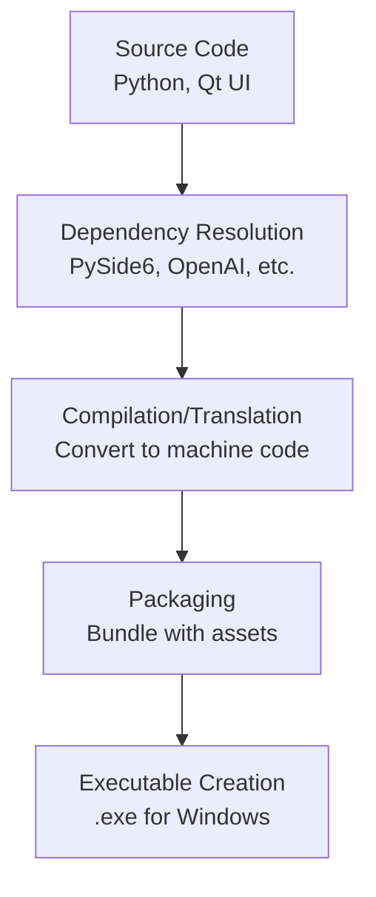

# OP(AI)UM — AI-Powered Windows File Manager

<div align="center">

**Your files, intelligently managed.**

OP(AI)UM is a Windows desktop application that combines an elegant file explorer with an AI-powered chat interface. Ask natural language questions about your files, organize them with a single command, and undo anything.

---

## ✨ Features

### 🗂️ Smart Explorer
- **Recent Files & Folders** — Automatically tracks recently accessed items from Windows Recent
- **Time-Grouped View** — Items organized into Last 2 Days, Last Week, Last Month, Older
- **Card Grid Layout** — Visual cards with icons, sizes, and timestamps
- **Folder Tree Navigation** — Lazy-loading tree with Quick Access and drive enumeration
- **Preview Panel** — Instant metadata preview on selection
- **Search & Filter** — Real-time filtering by name, type, and extension

### 🤖 AI Chat Assistant
- **Natural Language Operations** — "Organize my Downloads by type", "Find duplicates in Photos"
- **21 AI-Callable Tools** — Count, rename, move, copy, delete, organize, find duplicates, and more
- **Preview & Approve** — Destructive operations show a preview and require explicit approval
- **Voice Input** — Speech-to-text via OpenAI Whisper
- **Quick Action Chips** — One-click shortcuts for common operations

### ↩️ Full Undo System
- **Operation Journal** — Every AI operation is recorded with full details
- **One-Click Undo** — Reverse renames, moves, copies, and reorganizations
- **History Panel** — Browse and undo past operations

### 🔒 Security
- **PIN or Password Lock** — Argon2id hashing with machine binding
- **Encrypted API Key** — Fernet encryption for stored credentials
- **Lock Screen** — Frameless branded lock screen on startup

### 🎨 Theming
- **Light & Dark Themes** — Comprehensive QSS stylesheets
- **Catppuccin-Inspired Dark** — Modern dark palette
- **Pastel Light** — Clean, soft light theme

---

## 📦 Installation

### From Installer
Download `OPAIUM_Setup_1.0.0.exe` from the Releases page and run it.

### From Source

```bash
# Clone
git clone https://github.com/veyon/opaium.git
cd opaium

# Create virtual environment
python -m venv .venv
.venv\Scripts\activate

# Install dependencies
pip install -r requirements.txt

# Run
python scripts/run_dev.py
```

### Requirements
- **Python 3.11+**
- **Windows 10/11** (uses Win32 APIs for .lnk resolution, NTFS USN Journal, Recycle Bin)
- **OpenAI API Key** (for AI features)

---

## 🏗️ Architecture

```
opaium/
├── src/
│   ├── main.py              # Entry point
│   ├── app.py               # Application controller
│   ├── config/              # Settings, encryption, constants
│   ├── auth/                # PIN/password authentication
│   ├── core/                # Data engine (Recent parser, USN Journal, tracking DB)
│   ├── ai/                  # AI engine, function registry, speech
│   │   └── tools/           # 21 AI-callable file operation tools
│   ├── undo/                # Undo journal and manager
│   └── ui/                  # PySide6 UI layer
│       ├── explorer/        # Card grid, tree view, preview panel
│       ├── chat/            # Message bubbles, input, approvals
│       ├── history/         # Operation history panel
│       ├── settings/        # Tabbed settings dialog
│       ├── notifications/   # Toast notifications
│       ├── widgets/         # Reusable components
│       ├── title_bar.py     # Custom frameless title bar
│       └── main_window.py   # Top-level window
├── assets/themes/           # Light & dark QSS stylesheets
├── scripts/                 # Build, dev, lint, test runners
├── installer/               # Inno Setup configuration
├── tests/                   # Pytest test suite
└── docs/                    # Architecture documentation
```

---

## 🛠️ AI Tools

| Tool | Type | Description |
|------|------|-------------|
| `count_files` | Read | Count files with filters |
| `get_file_sizes` | Read | Size analysis (total/breakdown/largest) |
| `summarize_file_types` | Read | File type breakdown |
| `find_large_files` | Read | Files above size threshold |
| `find_duplicates` | Read | MD5 hash-based duplicate detection |
| `analyze_file_ages` | Read | Find stale/old files |
| `read_metadata` | Read | Image dimensions, file metadata |
| `disk_usage` | Read | Drive info and folder usage |
| `startup_programs` | Read | List Windows startup programs |
| `recycle_bin` | Read/Write | Query or empty Recycle Bin |
| `rename_files` | Write | Selective/batch rename |
| `regex_rename` | Write | Pattern-based rename |
| `change_extensions` | Write | Batch extension rename |
| `move_files` | Write | Move with conflict resolution |
| `copy_files` | Write | Copy with conflict resolution |
| `delete_files` | Write | Delete to Recycle Bin |
| `organize_by_type` | Write | Auto-sort into type folders |
| `organize_by_date` | Write | Sort into YYYY-MM folders |
| `flatten_folder` | Write | Un-nest folder structure |
| `clean_empty_folders` | Write | Find and remove empty dirs |

---

## 🔧 Development

```bash
# Lint & format
python scripts/lint.py --fix

# Run tests
python scripts/run_tests.py --verbose --coverage

# Build executable
python scripts/build.py
```

These commands represent the core stages of a professional software development workflow. Let me break down what each means and why they matter.

## 📝 Overview: The Development Pipeline


## 1. 🔍 Lint & Format (`python scripts/lint.py --fix`)

### What is Linting?
**Linting is the automated checking of your source code for programmatic and stylistic errors** 【turn0search1】【turn0search2】. It's like having a super-powered spelling and grammar checker for your code that catches:
- **Programmatic errors**: Undefined variables, syntax mistakes, potential bugs 【turn0search2】
- **Stylistic issues**: Inconsistent formatting, violations of coding standards 【turn0search3】
- **Security vulnerabilities**: Some patterns that could lead to security issues 【turn0search2】
- **Maintainability problems**: Code that's hard to read or maintain 【turn0search2】

### What is Formatting?
**Formatting focuses purely on code presentation and readability** 【turn0search2】. It automatically adjusts:
- Indentation and spacing
- Line length and wrapping
- Bracket and parenthesis placement
- Quote consistency
- Other stylistic elements

### Key Differences

| Aspect | Linting | Formatting |
|--------|---------|------------|
| **Purpose** | Find errors & enforce quality | Ensure consistent style |
| **Focus** | Program logic & correctness | Visual presentation |
| **Issues Found** | Bugs, security flaws, errors | Inconsistent spacing, line length |
| **Auto-Fix** | Some tools can auto-fix | Primarily auto-fixes |
| **Example Tools** | ESLint, Pylint, Ruff | Prettier, Black, autopep8 |

### In Your Context
The command `python scripts/lint.py --fix` likely:
1. **Runs a linter** (probably Ruff, as it's modern and fast 【turn0search4】) to check your Python code
2. **Automatically fixes** what it can (like import sorting, simple style issues)
3. **Reports remaining issues** that need manual attention

> 💡 **Pro Tip**: Linters are highly configurable and can enforce team coding standards, making code reviews faster and onboarding easier 【turn0search2】【turn0search4】.

## 2. 🧪 Run Tests (`python scripts/run_tests.py --verbose --coverage`)

### What is Software Testing?
**Software testing is the process of evaluating and verifying that a software product functions correctly, securely, and efficiently** 【turn0search5】. It involves:
- **Verification**: Checking if the software meets requirements
- **Validation**: Ensuring the software meets user needs
- **Defect detection**: Finding bugs before users do 【turn0search6】

### Types of Testing
Based on your test dependencies (`pytest-qt`, `pytest-asyncio`), you're likely doing:

| Test Type | Purpose | When to Use |
|-----------|---------|-------------|
| **Unit Tests** | Test individual components | During development |
| **Integration Tests** | Test component interactions | After integration |
| **Functional Tests** | Test features from user perspective | Before release |
| **Regression Tests** | Ensure new changes don't break existing features | After changes |

### In Your Context
Your command:
- `--verbose`: Shows detailed test output
- `--coverage`: Measures how much of your code is tested

This helps ensure your Qt6 application, OpenAI integrations, and database operations work correctly.

> ⚠️ **Important**: Testing is critical for maintaining code quality and preventing bugs in production 【turn0search7】. It provides objective information about software quality 【turn0search8】.

## 3. 🏗️ Build Executable (`python scripts/build.py`)

### What is a Build?
**A software build is the process of compiling source code into executable code ready for use** 【turn0search12】. It involves:



### What is an Executable?
**An executable is a file that contains instructions the operating system can run** 【turn0search11】. For your project:
- On Windows: A `.exe` file that launches your Qt application
- Contains your Python code, dependencies, and resources
- Allows users to run your application without installing Python

### Build Types
Your script might perform either:

| Build Type | Description | Advantage |
|------------|-------------|-----------|
| **Full Build** | Starts from scratch every time | Clean, predictable results |
| **Incremental Build** | Only rebuilds changed parts | Faster for small changes |

### In Your Context
The command `python scripts/build.py` likely:
1. **Uses `cx-Freeze`** (from your requirements) to bundle your Python application
2. **Creates a standalone executable** that includes:
   - Your Python code
   - Qt6 libraries (PySide6)
   - All dependencies (OpenAI, sounddevice, etc.)
   - Resources (icons, images, etc.)
3. **Produces a distributable file** that users can run without technical knowledge

> 🔧 **Technical Note**: The build process transforms your human-readable code into machine-executable format 【turn0search10】, resolving dependencies and creating a deployable package 【turn0search12】.

## 🎯 Why These Steps Matter in Your Workflow

### For Your OP(AI)UM Project:
1. **Lint & Format**: Ensures your Qt6 UI code, OpenAI API calls, and database interactions are clean and maintainable
2. **Run Tests**: Verifies your speech recording, database operations, and encryption work correctly
3. **Build Executable**: Creates a Windows application users can install and run easily

### Integration Benefits:
- **Consistency**: Enforced coding standards across all team members 【turn0search4】
- **Quality**: Automated checks catch errors before they become problems 【turn0search2】
- **Reliability**: Tests ensure features work as expected 【turn0search5】
- **Deployability**: Executables simplify distribution to end users 【turn0search12】

## 📊 Summary Comparison

| Stage | Input | Output | Primary Tool | Purpose |
|-------|-------|--------|--------------|---------|
| **Lint & Format** | Source code | Clean, consistent code | Ruff, Black | Catch errors & enforce style |
| **Run Tests** | Application code | Test results, coverage report | pytest | Verify functionality |
| **Build Executable** | Tested code | Standalone application | cx-Freeze | Create distributable program |

These commands form a **quality assurance pipeline** that transforms your development code into a polished, reliable application ready for users. Each step builds on the previous one, ensuring that only properly formatted, tested code gets built into the final executable.


---

The correct order depends on what you are trying to achieve. Here are the two most common workflows:

### 1. The "Quality Gate" Workflow (Recommended for Finalizing)
If you have finished coding and want to ensure your code is clean, correct, and ready to be packaged into an executable, run them in this order:

```bash
# 1. Clean the code (Fix style, find syntax errors)
python scripts/lint.py --fix

# 2. Verify logic (Ensure nothing is broken)
python scripts/run_tests.py --verbose --coverage

# 3. Package the application (Create the .exe)
python scripts/build.py
```

**Why this order?**
*   **Lint first:** It automatically fixes style issues and catches syntax errors. There is no point in testing code that has syntax errors.
*   **Test second:** There is no point in building an executable (`build.py`) if the application crashes or the tests fail.
*   **Build last:** You only package the application once you have verified it works.

---

### 2. The "Active Development" Workflow
If you are currently coding and want to see your changes, `run_dev.py` is your primary tool. You typically run it *before* the others, or in a separate terminal window.

```bash
# 1. Run the app to see your changes live
python scripts/run_dev.py

# (While the app runs or after you close it...)
# 2. Clean up & Test before committing your code
python scripts/lint.py --fix
python scripts/run_tests.py --verbose --coverage
```

### Summary Rule of Thumb
*   **Run Dev**: While you are building/writing code.
*   **Lint**: Before you commit code (to clean it up).
*   **Test**: Before you build (to prove it works).
*   **Build**: When you are ready to release/distribute.


## 📄 License

MIT License — see [LICENSE](LICENSE) for details.

---

<div align="center">
Built with ❤️ by <strong>Sankar Balasubramanian</strong>
</div>

